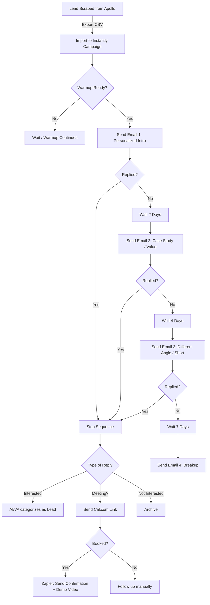

# Torque AI Automated Outreach System Plan

**Objective:** Send hundreds (500+) of personalized cold emails per day, follow up automatically, and book calls with zero human involvement.

## 1. Cold Email Automation Stack

**Winner:** **Instantly.ai**

### Why Instantly?
- **Unlimited Inboxes:** Crucial for scaling. You can add 10, 50, or 100 email accounts without paying extra per seat.
- **Built-in Warmup:** Included for free on all accounts. Essential for keeping domains healthy.
- **Unibox:** Manages all replies from all 15+ inboxes in one central place.
- **Cost:** Flat monthly fee ($37/mo for Growth, $97/mo for Hypergrowth) rather than per-user pricing.

### Comparison Table

| Feature | **Instantly.ai** (Recommended) | **Smartlead.ai** | **Lemlist** | **Apollo.io** |
| :--- | :--- | :--- | :--- | :--- |
| **Best For** | High Volume & Agency Scale | High Volume & Agency Scale | Highly Personalized (Images/Video) | All-in-One Data + Sending |
| **Pricing** | $37/mo (Unlimited Inboxes) | $39/mo (Unlimited Inboxes) | $59/mo per user | $49/mo per user |
| **Warmup** | Included (Unlimited) | Included (Unlimited) | $29/mo addon (or higher plan) | Basic included |
| **Custom Domain** | Yes | Yes | Yes | Yes |
| **Lead Database** | No (B2B Lead Finder add-on available) | No | No (Database add-on available) | **YES (Best in class)** |
| **API** | Yes | Yes | Yes | Yes |

**Recommendation:** Use **Instantly.ai** for sending/infrastructure and **Apollo.io** purely for lead data. This hybrid approach is cheaper and safer than doing everything in Apollo (which gets expensive at scale and risks your main domain).

---

## 2. Lead Generation Automation

**Strategy:** Cheap, high-quality volume.

### Source: Apollo.io
Apollo has the best B2B database.
- **Action:** Sign up for the **Basic ($49/mo)** or **Professional ($79/mo)** plan.
- **Exporting:** Use the export credits to pull 1,000+ leads/month.
- **Filter:** 
    - Industry (verticals)
    - Company Size (11-50, 51-200)
    - Title (Founder, CEO, CTO, VP Sales)
    - **"Verified Email Only"** (Crucial)

### Enrichment (Optional but Recommended)
For "Torque AI," relevant personalization is key.
- **Clay.com:** Use if you need to scrape websites to find specific tech stacks or recent news.
- **Cheapest Path:** Export from Apollo → Clean list with **Reconcile.ly** or **NeverBounce** (Instantly has basic verification, but an external check is safer) → Upload to Instantly.

---

## 3. Email Infrastructure (The Engine)

To send 500 emails/day safely, you cannot use one account.

### The Math
- **Safe Limit:** 30-40 emails per inbox per day (including warmups).
- **Target:** 500 emails/day.
- **Inboxes Needed:** ~15 inboxes.
- **Domains Needed:** Max 3 inboxes per domain to minimize risk.
- **Total:** **5 Domains** with **3 inboxes each** (e.g., `corey@trytorque.ai`, `corey@gettorque.net`, `corey@torque-ai.co`).

### Provider Setup
**Google Workspace** is the gold standard for deliverability but costs $6/mo/inbox.
- **Cost for 15 inboxes:** 15 * $6 = $90/mo.
- **Alternative (Cheaper):** **Outlook/Microsoft 365** ($6/mo) or specialized bulk providers like **InfraForge** (cheaper but more technical).
- **Recommendation:** Stick to **Google Workspace** for the first batch to ensure highest deliverability.

### Technical Setup
For *each* of the 5 domains, you must configure:
1.  **SPF (Sender Policy Framework):** Authorizes Google to send email for you.
2.  **DKIM (DomainKeys Identified Mail):** Digital signature to verify sender identity.
3.  **DMARC:** Policy on what to do with fake emails (set to `p=none` for warmup, `p=quarantine` later).
4.  **Forwarding:** Forward all 15 inboxes to one master inbox (e.g., `sales@torque.ai`) so you never miss a reply, though Instantly's Unibox handles this too.

### Warmup Timeline
- **Week 1:** 5 emails/day (ramp up by 2-3/day).
- **Week 2:** 15-20 emails/day.
- **Week 3:** 30-40 emails/day.
- **Ready to Send:** **Day 14-21**.
- **Do NOT rush this.** If you burn a domain, it's gone forever.

---

## 4. Automation Workflow

---

## 5. Cost Breakdown (Monthly)

Running at ~500 emails/day capacity.

| Item | Service | Estimated Cost |
| :--- | :--- | :--- |
| **Email Software** | Instantly.ai (Growth) | $37.00 |
| **Lead Data** | Apollo.io (Basic) | $49.00 |
| **Domains** | Namecheap (5 domains @ ~$10/yr) | ~$4.00 (amortized) |
| **Email Accounts** | Google Workspace (15 users @ $6) | $90.00 |
| **Total** | | **~$180.00 / month** |

*Note: You can reduce Email Account costs by using bulk providers, but Google is safest.*

---

## 6. Setup Checklist

- [ ] **Buy Domains:** Purchase 5 secondary domains (e.g., `get-torque.com`, `try-torque.ai`, `torque-app.net`). **Do NOT use your main domain.**
- [ ] **Setup Workspace:** Create a Google Workspace account. Add the 5 domains. Create 3 users per domain (e.g., `firstname@`, `firstname.lastname@`, `hello@`).
- [ ] **DNS Records:** Login to DNS provider (Namecheap/GoDaddy). Add TXT records for SPF, DKIM, and DMARC for *all* domains.
- [ ] **Forwarding:** Set up email forwarding to your main inbox so you see replies immediately.
- [ ] **Instantly Setup:**
    - [ ] Create Instantly account.
    - [ ] Connect all 15 email accounts.
    - [ ] Enable "Warmup" on all accounts.
    - [ ] Set limit to 40 emails/day per account.
- [ ] **Leads:** Export 1,000 leads from Apollo (CSV).
- [ ] **Copywriting:** Write a 4-step sequence (Intro, Value, Case Study, Breakup). Spintax is recommended (e.g., `{{Hi|Hello|Hey}}`) to vary content.
- [ ] **Launch:** Schedule campaign to start *after* 14 days of warmup.

---

## 7. Timeline

- **Day 1 (Today):** Buy domains, set up Google Workspace, configure DNS. Connect to Instantly. **Start Warmup.**
- **Day 1-14:** **WARMUP PERIOD.** Do nothing but let the bots talk to each other.
- **Day 7:** Source leads from Apollo. Write email copy.
- **Day 14:** Review warmup scores (aim for >95% health).
- **Day 15:** **GO LIVE.** Launch first campaign at low volume (50 emails/day total).
- **Day 21:** Ramp up to full volume (500 emails/day).
