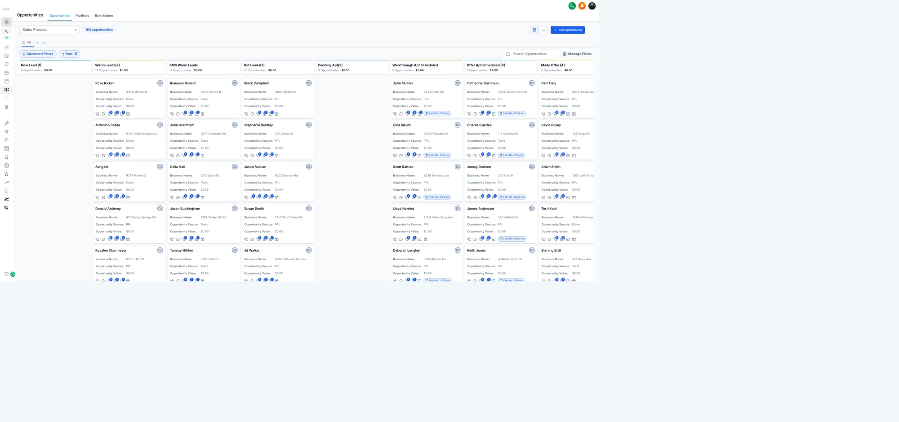
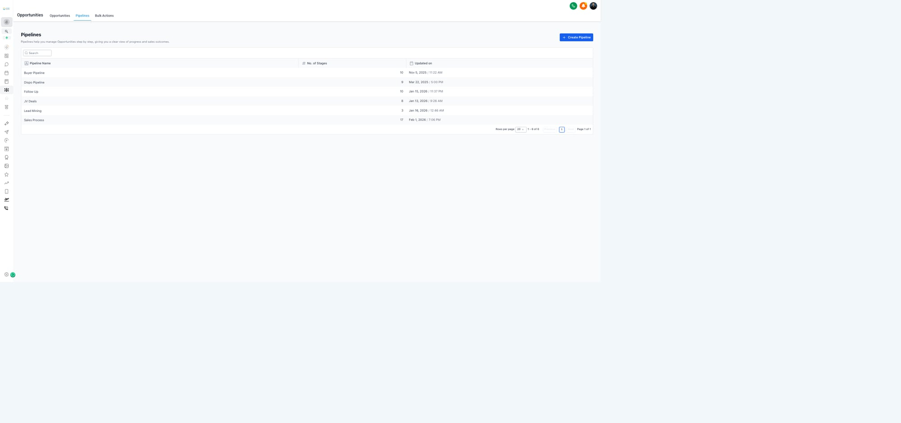

# Module 3: Lead Management (LM)
**Role:** Lead qualification through appointment setting
**Team:** Chris, Daniel
**Process Map Phases:** 2, 3, 4, and Follow Up
**Status:** v2 — Rebuilt from Process Map — Feb 3, 2026

---

## 3.1 LM Role Overview

### Where You Fit in the Process
```
Lead Gen → [YOU: Research → Contact → Appointment] → AM Walkthrough → Offer → Contract
                    ↓
              [YOU: Follow Up]
```

### Your Phases
| Phase | Name | What You Do |
|-------|------|-------------|
| 2 | Research & Qualification | Verify lead data, qualify |
| 3 | Initial Contact | Call leads, assess interest |
| 4 | Appointment Setting | Book and confirm walkthroughs |
| 8 | Follow Up | Nurture non-converts |

### Daily Responsibilities
1. **Call leads when assigned** — you get notified when Data Manager moves lead to Warm/Hot
2. **Work follow-up pool** — this is where most of your time goes (thousands of leads)
3. Qualify interest on every call
4. Set appointments when leads are ready (10-20% of contacts)
5. Confirm upcoming appointments
6. Update lead status and pipeline in GHL

**Reality check:** You'll spend more time on follow-up than new leads. That's the job.

### KPIs You're Measured On
| Metric | Description |
|--------|-------------|
| Calls | Outbound call attempts (target: 20/day) |
| Conversations | Two-way contact with lead |
| Qualified Leads | Leads that pass qualification |
| Appointments Set | Walkthroughs booked |
| Show Rate | % of apts that happen |

---

## 3.2 GHL Navigation for LMs

### Your Main Workspace: The Pipeline Board
The Opportunities board is where you'll spend most of your time. Each column is a stage:


*Sales Process pipeline showing lead cards organized by stage*

**Key columns for LMs:**
- **New Lead** — Waiting for Data Manager
- **Warm Leads** — Your queue to call (assigned to you)
- **Hot Leads** — Priority calls (3+ qualifying factors)
- **Pending Apt** — Leads ready for appointment
- **Walkthrough Apt Scheduled** — Booked appointments

### All Available Pipelines
NAH uses multiple pipelines for different deal stages:


*Six pipelines track deals through the entire process*

**Pipelines you interact with:**
- **Sales Process** — Your main workflow (New Lead → Contract)
- **Follow Up** — Long-term nurture leads
- **JV Deals** — Joint venture opportunities (ask AM)

---

## 3.3 When New Leads Come In

### What Happens at 🟢 New Leads Created
When a lead enters the system:

```
🟢 New Leads Created
    ↓
[GHL] Lead lands in "New Lead" column
    ↓
[Data Manager] Cleans data, verifies info
    ↓
[Data Manager] Moves lead to "Warm Lead" or "Hot Lead" column
    ↓
[AUTOMATION] Stage change triggers:
    ├── Assigns lead to LM
    └── Sends notification to LM
    ↓
[YOU - LM] Now call the lead
            ↓
          Qualify New Lead Task
```

### Your Job: Call When Assigned
- **You wait** for Data Manager to clean and move the lead
- Once moved to Warm/Hot column, you get assigned + notified
- GHL notification = your cue to engage
- **Weekend note:** Speed-to-lead slows down when Data Manager isn't working

### How Data Manager Classifies Warm vs Hot
**5-Factor Scoring:**
1. Timeline — Ready to sell soon?
2. Condition — Property needs work?
3. Price — Asking below market?
4. Motivation — Real pain driving the sale?
5. Source — Quality lead source?

**3+ factors = Hot Lead**

### The Reality of Conversion
```
New Leads Called
    ↓
├── 10-20% → Ready now → 🟢 Apt Scheduled
└── 80-90% → Not ready → Follow Up (your ongoing pool)
```

**Most leads don't convert on first call.** That's normal. Your job is to:
1. Make contact
2. Qualify interest
3. Set apt if ready, or add to follow-up if not

---

## 3.3 Phase 3: Initial Contact

### The Call Flow
```
Call New Lead
    ↓
Qualify New Lead (20 calls/day target)
    ↓
Answered? 
    ├── YES → Check Interest
    └── NO → Working Lead / Drip Campaign
```

### Opening Script
```
"Hi, is this [NAME]? 
This is [YOUR NAME] with New Again Houses. 
I'm calling about [ADDRESS] — saw you might be looking to sell. 
Is this still something you're considering?"
```

### If They Answer — Interest Check
```
Interested? (decision)
    ├── YES → Move to Appointment Setting (Phase 4)
    ├── MAYBE → Working Lead, schedule follow-up
    ├── NO → Check all qualify new leads sent
    └── GHOSTED → Ghosted path, add to drip
```

### If No Answer
```
No Answer
    ↓
Working Lead / Lost Stay Organized
    ↓
Put on Drip Campaign
    ↓
Continue calling (part of 20/day)
```

### Qualifying Questions
1. **Timeline:** "What's your timeline for selling?"
2. **Motivation:** "What's making you consider selling now?"
3. **Condition:** "How would you describe the property's condition?"
4. **Decision Maker:** "Are you the owner? Anyone else involved in the decision?"
5. **Price Expectation:** "Do you have a number in mind?"

### Interest Outcomes
| Response | Action | Next Step |
|----------|--------|-----------|
| "Yes, interested" | Qualify further | Set appointment |
| "Maybe, not sure" | Working lead | Schedule follow-up |
| "No, not selling" | DQ or nurture | Add to long-term drip |
| No response/ghosted | Ghosted path | Continue drip attempts |

---

## 3.4 Phase 4: Appointment Setting

### When to Set an Appointment
Only set appointments for leads who:
- ✅ Confirmed interest in selling
- ✅ Are the decision maker (or can get them)
- ✅ Have a property we can evaluate
- ✅ Have some timeline (even if vague)

### Setting the Appointment
```
Interested? → YES
    ↓
Set Apt Up
    ↓
Book in GHL Calendar (Walkthrough Appointment)
    ↓
[AUTOMATION] Pre-Apt Autoconfirmation fires
    ↓
Task Created to Set Appt Number
    ↓
Confirm Apt
    ↓
Stage 2 Completed ✓
```

### Booking Script
```
"Great, sounds like we might be able to help. 
The next step is a quick walkthrough so Kyle can see the property 
and put together an offer. Takes about 15-20 minutes.

I have [TIME SLOT A] or [TIME SLOT B] available — which works better for you?"
```

### What to Collect Before Booking
- [ ] Confirmed date/time
- [ ] Property address (verify)
- [ ] Best contact number
- [ ] Access instructions (gate code, dogs, etc.)
- [ ] Who will be there
- [ ] Any special notes for AM

### After Booking — What Happens Automatically
1. **Pre-Apt Autoconfirmation** — Seller gets confirmation SMS/email
2. **Task Created** — Team notified
3. **Moved to "Apt Scheduled" column** — Pipeline updates
4. **Stage 2 Completed** — Lead progresses

### Confirmation Call (Day Before)
```
"Hi [NAME], this is [YOUR NAME] from New Again Houses. 
Just confirming your appointment tomorrow at [TIME] at [ADDRESS]. 
Kyle will be the one coming out. Does that still work for you?"
```

---

## 3.5 Follow-Up: Where Most Leads Live

### The Reality
**80-90% of leads go to follow-up.** This is normal and expected.

You're always working TWO pools:
1. **New leads** — Call immediately when they come in
2. **Follow-up leads** — Thousands of records being worked continuously

```
After First Contact
    ↓
├── 10-20% Ready NOW → Apt Scheduled
└── 80-90% Not Ready → Follow Up Pool
                         ↓
                    ├── Eventually responds → Maybe apt
                    └── No response 10-14 days → Ghosted
```

### Follow-Up Tiers

#### Hot Follow Up
- **Who:** Interested, just not ready right now
- **Cadence:** Call within 24-48 hours
- **Goal:** Lock in appointment when timing is right

#### Warm Follow Up  
- **Who:** Some interest but hesitant
- **Cadence:** Call every 2-3 days
- **Goal:** Build rapport, stay top of mind

#### Cold Follow Up
- **Who:** Low interest or went quiet
- **Cadence:** Weekly touch, mostly automated
- **Goal:** Be there when situation changes

### Ghosted (10-14 Days No Response)
If a new lead has **no response after 10-14 days**, they move to Ghosted status.
- Still in system, but lower priority
- May get occasional drip/automation
- Can be re-engaged if they respond later

---

## 3.6 Phase 8: Follow-Up System

### The Follow-Up Flow
```
[Entry] → Contact Attempt
    ↓
Answered?
    ├── YES → Tag Created → Pipeline Changed → Next Action
    └── NO → Continue sequence (Hot/Warm/Cold)
```

### Follow-Up Actions
| Outcome | System Action |
|---------|---------------|
| Answered + Interested | Tag Created → Pipeline Changed → Specific Task |
| Answered + Not Ready | Schedule next follow-up |
| No Answer | Continue drip sequence |
| Dead Lead | Dead Lead Tag (x2) → DNC Assessment |

### Drip Campaign Logic
```
No Answer / Not Ready
    ↓
├── Apts created → 3 Day SMS → Email Nurturing
├── All Calls, visits, missed → Task Created
└── Dead Lead Tag → DNC Assessment
    ↓
Contact? (decision)
    ├── YES → Update Daily Dashboard → Back to Follow-up
    └── NO → For Follow-up/Abandoned → Survey Call (end)
```

### When to Stop Following Up
- Lead explicitly says "Do not contact"
- 3+ months with no response
- Property sold (verify)
- Lead is clearly unqualified

### Survey Call (End of Sequence)
For leads exiting the funnel, optional survey:
```
"Hi [NAME], this is [YOUR NAME] from New Again Houses. 
I know we've been trying to connect about [ADDRESS]. 
Just wanted to check — have you made a decision on the property, 
or is selling something you might consider down the road?"
```

---

## 3.7 GHL Workflows — LM

### New Lead Automation
**Location:** `Acquisitions > New Lead Automation`
- Triggers when new lead enters
- Adds to research queue
- Starts qualification process

### Appointment Management
**Location:** `Acquisitions > Appointment Management > Walkthrough Apts`
- **NAH Walkthrough Apt Confirmation** — Main workflow
- Triggers on apt booked
- Sends confirmations, reminders

### Follow Up Organization
**Location:** `Acquisitions > Follow Up Organization`
- Manages follow-up sequences
- Tracks Hot/Warm/Cold status
- Handles drip campaigns

---

## 3.8 Handling Objections

### "I'm not ready yet"
```
"Totally understand. Most sellers we work with weren't sure at first either. 
What would need to change for you to be ready? 
(Listen)
Would it be okay if I checked back in [TIMEFRAME]?"
```

### "I want to list with an agent"
```
"That makes sense. What's driving that decision?
(Listen)
A lot of our sellers started that way too. The main difference is 
we close fast, buy as-is, and handle everything. 
Would it hurt to at least see what we'd offer before you decide?"
```

### "I need to talk to [spouse/family]"
```
"Absolutely — big decisions need everyone on board. 
When do you think you'll have a chance to discuss?
(Listen)
Perfect, I'll follow up on [DAY]. Anything I can send to help the conversation?"
```

### "What's your offer going to be?"
```
"Great question. We won't know the exact number until Kyle walks through 
and evaluates the property. But I can tell you we make fair cash offers 
and close fast. The walkthrough is just 15-20 minutes — 
would [TIME] work for you?"
```

---

## 3.9 Daily Dashboard

### What to Update Daily
At end of each day, ensure:
- [ ] All call outcomes logged
- [ ] Pipeline stages updated
- [ ] Follow-up tasks scheduled
- [ ] Appointments confirmed for tomorrow
- [ ] Notes added to all contacted leads

### Stage Progression
| Stage | Meaning | Your Action |
|-------|---------|-------------|
| New Lead | Just entered | Research & call |
| Working | In contact, not apt yet | Follow up |
| Apt Scheduled | Walkthrough booked | Confirm |
| Stage 2 Complete | Apt confirmed | Hand to AM |
| Ghosted | No response | Drip campaign |
| Dead | Not qualified | Tag & close |

---

## Quick Reference

### Daily Targets
- 📞 20 calls per day
- 📅 X appointments per week (discuss with Corey)
- ✅ 100% follow-up completion

### Key Decision Points
1. **Researched?** → Ready to call?
2. **Answered?** → Did they pick up?
3. **Interested?** → Want to sell?
4. **Contact?** → Keep following up?

### Handoff to AM
When Stage 2 is complete:
- Apt is confirmed
- Seller info is in GHL
- Notes include motivation, condition, access
- AM (Kyle) takes over for walkthrough

---

*Last updated: Feb 3, 2026 — Rebuilt from Process Map v2*
