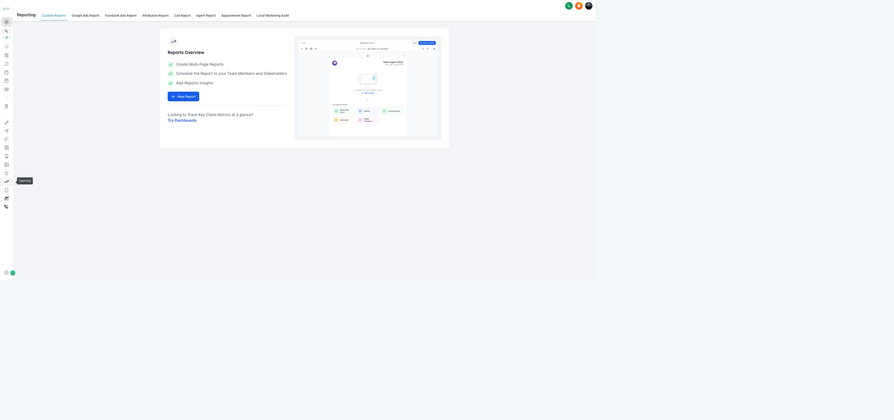
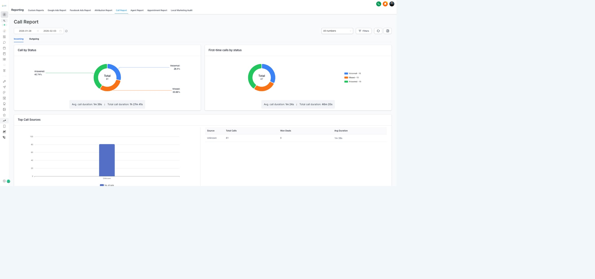

# Module 6: Operations & Admin
**Role:** Keeping the machine running
**Team:** Jessica (Data Manager)
**Status:** Draft — Feb 3, 2026

---

## 6.1 Operations Role Overview

### What Ops Does
Operations is the backbone — making sure data flows correctly, metrics are tracked, and the team has what they need.

**Primary Responsibilities:**
1. Lead data entry and cleanup
2. KPI tracking and reporting
3. Channel routing (who handles what)
4. System maintenance

### Where Ops Fits
```
Lead Gen → [OPS: Data Cleanup] → LM → AM → [OPS: KPI Tracking] → Dispo → Close
              ↑                                    ↑
        Quality control                    Performance tracking
```

---

## 6.2 Lead Data Entry & Cleanup

### The Handoff Flow
```
New Lead Created
    ↓
[GHL] Lands in "New Lead" column
    ↓
[YOU] Clean/verify data:
    - Name correct?
    - Phone valid?
    - Property address accurate?
    - Any notes from source?
    ↓
[YOU] Score using 5 factors:
    - Timeline
    - Condition
    - Price
    - Motivation
    - Source
    ↓
3+ factors? → "Hot Lead" column
< 3 factors? → "Warm Lead" column
    ↓
[AUTOMATION] Assigns LM + sends notification
```

### Data Fields to Verify
| Field | Check For |
|-------|-----------|
| Contact Name | Spelling, completeness |
| Phone | Valid format, callable |
| Property Address | Full address, correct format |
| Source | Where lead came from |
| Initial Notes | Any context from caller/form |

### Adding to MasterSuite
When lead is cleaned:
1. Add property to MasterSuite with available details
2. Link MasterSuite record in GHL notes (if applicable)
3. This enables property evaluation later

---

## 6.3 KPI Spreadsheet Management

### The Spreadsheet
**URL:** [KPI Spreadsheet](https://docs.google.com/spreadsheets/d/1erZTFb87xbxZEct7mZqFCW7Nb-47_t_LNtK-TfkYYas/)

### Tabs You Manage

| Tab | What It Tracks | Update Frequency |
|-----|----------------|------------------|
| Scoreboard | P&L, goals, ROIs | Auto-calculates |
| AM Spotlight | Kyle's daily metrics | Daily |
| LM Spotlight | Chris/Daniel's calls, apts | Daily |
| LG Spotlight | Lead gen metrics | Daily |
| Campaign INPUT tabs | Spend, leads by channel | As campaigns run |
| Deals | Individual deal details | As deals progress |

### Daily Entry Tasks
1. **LM Spotlight** — Enter calls made, conversations, appointments set
2. **AM Spotlight** — Enter walkthroughs, offers made, contracts
3. **LG Spotlight** — Enter outreach numbers, leads generated

### Campaign INPUT Tabs
Each channel has its own input tab:
- CC (Cold Calls)
- SMS
- Forms (Webforms)
- PPL (Pay Per Lead)
- JV (Joint Venture)
- PPC (Pay Per Click)
- Cards (Direct Mail)
- Referrals

**Enter:** Spend, outreach volume, leads generated

### Key Metrics to Watch
| Metric | What It Tells You |
|--------|-------------------|
| Cost per Lead | Efficiency of channel |
| Cost per Contract | True acquisition cost |
| Conversion % | Lead → Apt → Offer → Contract |
| ROI by Channel | Where to spend more/less |

---

## 6.4 GHL Reporting Tools

### Reporting Dashboard
GHL has built-in reporting for tracking team activity:


*Reports Overview with custom report builder*

**Available Report Types:**
- Custom Reports — Build your own
- Google Ads Report — Ad performance
- Facebook Ads Report — Social ad metrics
- Attribution Report — Lead source tracking
- Call Report — Call activity metrics
- Agent Report — Individual team member stats
- Appointment Report — Booking analytics

### Call Report (Key for LM Tracking)
The Call Report shows all call activity with detailed breakdowns:


*Call Report showing call status, duration, and source metrics*

**What This Report Shows:**
- **Call by Status** — Answered, Voicemail, Missed breakdown
- **First-time Calls** — New conversations vs. follow-ups
- **Top Call Sources** — Where calls originate
- **Avg/Total Duration** — Time spent on calls

**Use For:**
- Verifying LM call counts vs. KPI spreadsheet
- Identifying call quality issues (short calls = hangups)
- Tracking first-time contact rates

---

## 6.5 Channel Routing

### Who Handles What

| Channel | Owner | Response Time |
|---------|-------|---------------|
| Inbound calls | LM on rotation | Immediate |
| Inbound texts | LM on rotation | < 5 min |
| Webforms | Auto-assigned | LM calls within 1 hr |
| Buyer inquiries | Esteban | Same day |
| Google Chat alerts | Tagged person | ASAP |

### Escalation Path
```
Issue → Try to resolve → Can't? → Escalate

LM issue → Kyle (AM lead)
AM issue → Corey
Dispo issue → Corey
System issue → Corey
```

### Google Chat Channels
- **LM Channel** — LM team coordination, apt alerts
- **Dispo Channel** — Buyer/deal updates
- **General** — Company-wide

---

## 6.5 Weekly Reporting

### Reports You Generate

| Report | Frequency | Audience | Contents |
|--------|-----------|----------|----------|
| Weekly KPIs | Monday | Team | Last week's numbers |
| Pipeline Status | Wednesday | Corey | Deals in progress |
| Channel Performance | Friday | Corey | Spend vs results by channel |

### Weekly KPI Report Contents
1. Outreach numbers (calls, texts, mailers)
2. Leads generated by source
3. Appointments set
4. Offers made
5. Contracts signed
6. Deals closed
7. Revenue
8. Week-over-week comparison

---

## 6.6 GHL Housekeeping

### Housekeeping Workflows
Located in: **Housekeeping/** folder

| Workflow | Purpose |
|----------|---------|
| Delete Old Contacts | Clean up stale records |
| Delete Opportunity | Remove dead opportunities |

### When to Run Housekeeping
- Monthly review of stale leads (no activity 90+ days)
- After campaigns end — clean up non-responders
- Before major list imports — ensure clean slate

### What NOT to Delete
- Any lead with an appointment (past or future)
- Any lead in active follow-up
- Any lead associated with a deal
- When in doubt, ask before deleting

---

## 6.7 Daily Checklist

### Morning (Start of Day)
- [ ] Check New Lead column — any leads waiting for cleanup?
- [ ] Review overnight webform submissions
- [ ] Update yesterday's KPIs in spreadsheet

### Midday
- [ ] Check pipeline stages — anything stuck?
- [ ] Verify today's appointments in system
- [ ] Answer any data questions from team

### End of Day
- [ ] Final KPI entries
- [ ] Flag any issues for tomorrow
- [ ] Update MasterSuite if needed

---

## 6.8 Common Issues & Fixes

### Duplicate Leads
**Problem:** Same lead entered twice
**Fix:** Merge in GHL (keep the one with more history)

### Missing Data
**Problem:** Lead came in with incomplete info
**Fix:** Note what's missing, move to Warm (not Hot), LM can gather on call

### Wrong Assignment
**Problem:** Lead assigned to wrong LM
**Fix:** Reassign in GHL, notify correct LM

### KPI Discrepancy
**Problem:** Numbers don't match between GHL and spreadsheet
**Fix:** Pull GHL report, reconcile, update spreadsheet

---

*This module will be updated as ops processes evolve.*
