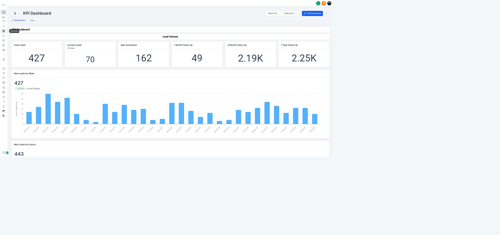
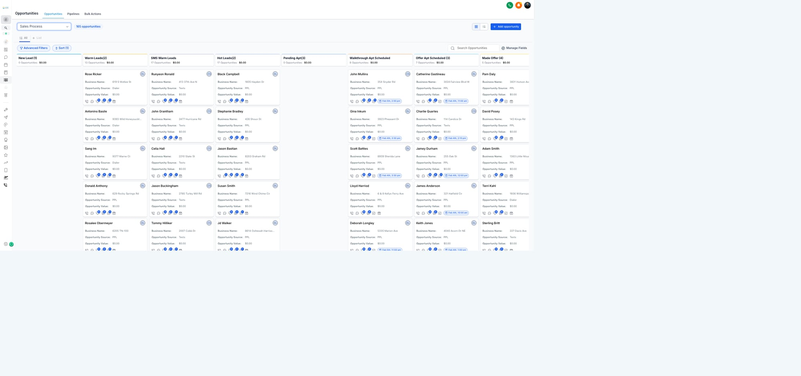
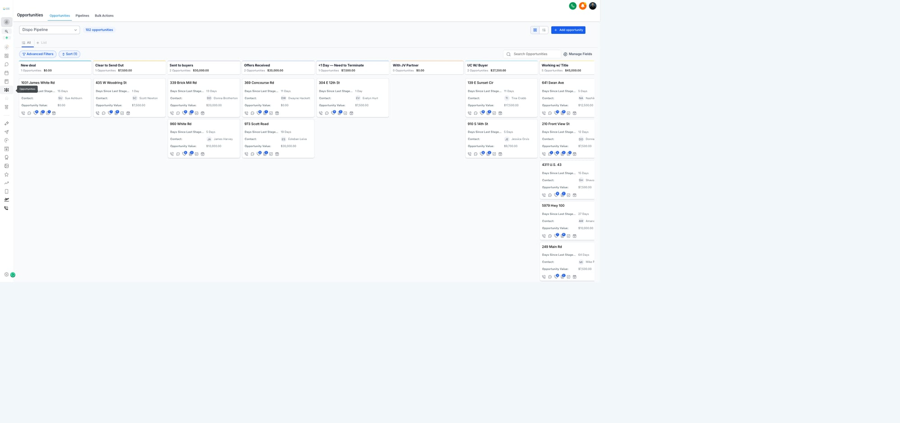
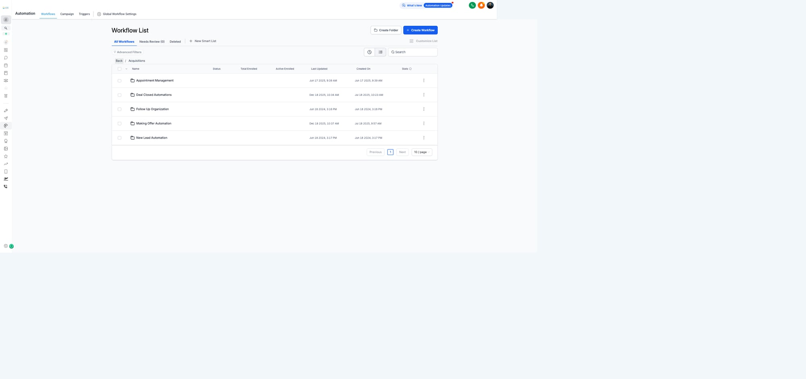
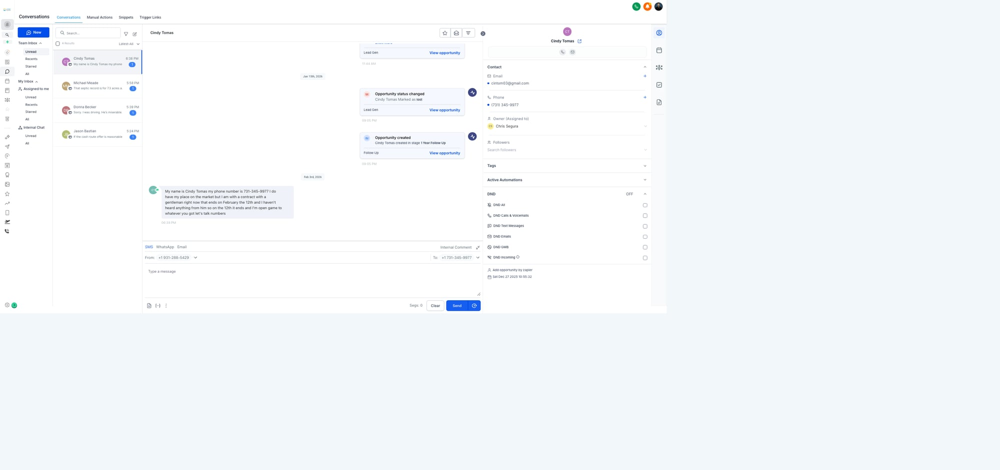
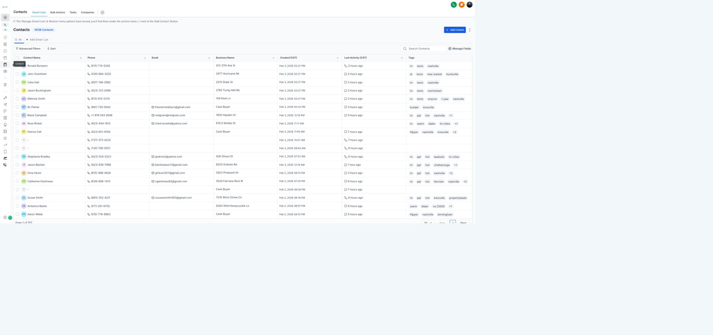
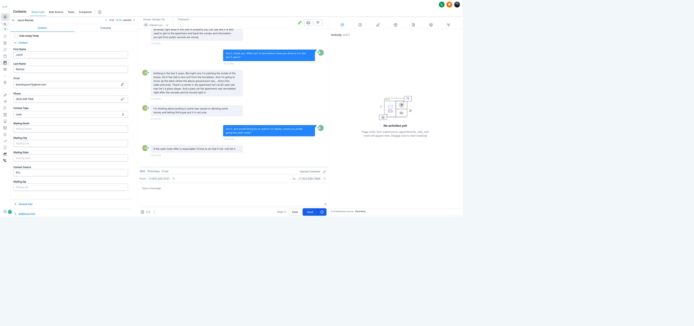
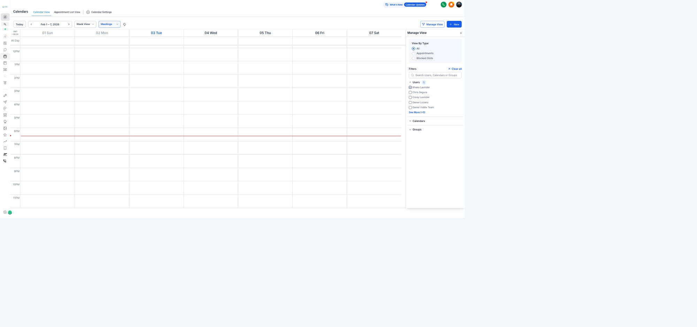

# Module 7: Tools & Systems
**Purpose:** How to use our tech stack
**Status:** Draft — Feb 3, 2026

---

## 7.1 Tool Overview

### Our Stack
| Tool | Purpose | Who Uses |
|------|---------|----------|
| GHL (GoHighLevel) | CRM, pipelines, automations, calls | Everyone |
| MasterSuite | Property evaluation, deal analysis | AM, Corey |
| Google Chat | Team communication | Everyone |
| Gunner | Call grading & coaching | LM, AM, Corey |
| KPI Spreadsheet | Performance tracking | Ops, Corey |
| BatchLeads | List building, skip tracing | Lead Gen |

---

## 7.2 GHL (GoHighLevel)

### Access
- **URL:** app.gohighlevel.com
- **Account:** New Again Houses Nashville
- **Your login:** Get from Corey


*GHL KPI Dashboard showing lead volume and follow-up metrics*

### Main Navigation

| Section | What It Does |
|---------|--------------|
| Contacts | All leads and buyers |
| Opportunities | Deals in pipeline stages |
| Conversations | All messaging (SMS, email, calls) |
| Calendars | Appointment scheduling |
| Automations | Workflow triggers |
| Reporting | Metrics and dashboards |

### Pipelines

**Sales Process Pipeline** (Leads → Deals)
```
New Lead → Warm → Hot → Apt Scheduled → Made Offer → Under Contract → Purchased
```
Also includes follow-up stages: 1mo, 4mo, 1yr, Ghosted, Not Closed, Sold, DNW


*Sales Process Pipeline showing leads moving through stages*

**Dispo Pipeline** (Deals → Buyers)
```
New Deal → Clear to Send → Sent to Buyers → Offers Received → UC w/ Buyer → Working w/ Title → Closed
```


*Dispo Pipeline showing deals being sold to buyers*

**Buyer Pipeline** (Buyer management)
- Priority buyers
- Qualified buyers
- JV partners
- Not qualified

### Key Automations by Folder


*Automation workflows organized in folders*

| Folder | Workflows |
|--------|-----------|
| Acquisitions/ | New Lead, Appointments, Offers, Follow Up, Deal Closed |
| Disposition/ | Buyer Automations, Dispo Automations |
| Lead Generation/ | Lead Mining |
| Housekeeping/ | Delete Old Contacts, Delete Opportunity |
| AI Caller/ | Experimental |

### Making Calls in GHL
1. Open contact record
2. Click phone icon
3. Call connects through GHL (recorded)
4. Notes auto-save to contact

### Sending Texts in GHL
1. Open contact → Conversations
2. Type message
3. Send (tracked in conversation history)


*Conversations inbox showing messages, contact info, and automations*

---

## 7.3 GHL Contacts & Opportunities


*Contacts list showing leads with phone, email, property, and tags*

### Contact Record
Every lead/buyer is a Contact. Key fields:
- Name, Phone, Email
- Property Address
- Tags (status indicators)
- Notes (conversation history)
- Associated Opportunities


*Contact detail view showing info, conversation, and activity*

### Opportunity Record
Deals in progress. Key fields:
- Stage (where in pipeline)
- Contact (linked lead)
- Value (deal amount)
- Custom fields: ARV, Repair Estimate, Contract Price, etc.

### Moving Stages
1. Open opportunity
2. Drag to new stage OR edit and select stage
3. Automations may trigger on stage change

---

## 7.4 GHL Calendars


*Calendar week view with team members and appointment filtering*

### Appointment Types
| Type | Purpose | Duration |
|------|---------|----------|
| Walkthrough Apt | In-person property visit | 30-60 min |
| Offer Call Apt | Phone call to present offer | 15-30 min |
| Buyer Showing | Property showing for buyer | 30 min |

### Booking an Appointment
1. Open contact record
2. Click calendar icon
3. Select appointment type
4. Choose date/time
5. Confirm → automations trigger (confirmation texts, internal alerts)

### Appointment Confirmations
When apt is booked:
- Seller gets confirmation text/email
- Internal notification to Google Chat
- Reminder sequences start (day before, morning of)

---

## 7.5 MasterSuite

### What It Does
Property evaluation and deal analysis — Corey's custom software.

### Property Analysis Stages (0-6)
| Stage | Meaning |
|-------|---------|
| 0 | Initial entry |
| 1 | Basic info gathered |
| 2 | Comps pulled |
| 3 | Repair estimate done |
| 4 | Offer calculated |
| 5 | Under contract |
| 6 | Closed |

### Key Data Points
- ARV (After Repair Value)
- Repair costs
- Comparable sales
- Offer price calculation
- Deal margin analysis

### Who Uses It
- **AM (Kyle)** — Property walkthroughs, repair estimates
- **Corey** — Deal review, final approval

*Note: MasterSuite is separate from GHL. Properties are tracked in both systems.*

---

## 7.6 Google Chat

### Channels

| Channel | Purpose | Who's In |
|---------|---------|----------|
| LM Channel | LM coordination, apt alerts | LMs, Kyle, Corey |
| Dispo Channel | Buyer updates, deal status | Esteban, Corey |
| General | Company-wide announcements | Everyone |

### Notification Rules
- **@mention** when you need someone specific
- **Apt alerts** auto-post to LM channel
- **Deal updates** auto-post to Dispo channel

### Response Expectations
| Alert Type | Expected Response |
|------------|-------------------|
| Direct @mention | ASAP (within 30 min) |
| Apt confirmation | Acknowledge seen |
| Deal update | Read, no response needed unless action required |

---

## 7.7 Gunner (Call Grading)

### What It Does
AI-powered call grading and coaching for sales calls.

### Access
- **URL:** getgunner.ai
- **Login:** Get from Corey

### How It Works
1. Calls made in GHL are recorded
2. Gunner pulls recordings automatically
3. AI grades calls on criteria (script adherence, objection handling, etc.)
4. Scores and feedback available in Gunner dashboard

### What Gets Graded
| Criteria | What It Measures |
|----------|------------------|
| Introduction | Proper opener, tone |
| Qualifying Questions | Did you ask the right things? |
| Objection Handling | How you responded to pushback |
| Call Control | Did you lead the conversation? |
| Close | Did you set apt or proper disqualify? |

### Using Feedback
1. Review your graded calls weekly
2. Note patterns in feedback
3. Practice weak areas
4. Discuss with manager if confused

---

## 7.8 KPI Spreadsheet

### Access
**URL:** [2026 KPIs Spreadsheet](https://docs.google.com/spreadsheets/d/1erZTFb87xbxZEct7mZqFCW7Nb-47_t_LNtK-TfkYYas/)

### Your Tab
| Role | Tab to Check |
|------|--------------|
| LM | LM Spotlight |
| AM | AM Spotlight |
| Lead Gen | LG Spotlight |
| Everyone | Scoreboard (read-only view) |

### What You Enter
Depends on role — see Module 6 (Operations) for full breakdown.

### What You Can See
- Your daily/weekly numbers
- Team performance
- Goal progress
- Channel ROI

---

## 7.9 BatchLeads

### What It Does
List building and skip tracing for lead generation.

### Key Functions
- Import property lists
- Skip trace (find owner contact info)
- Export for calling/texting campaigns

### Who Uses It
- Data Manager (Jessica)
- Cold Callers (for campaign lists)

*Detailed BatchLeads training covered in Module 2 (Lead Gen).*

---

## 7.10 Quick Reference

### Login Issues
- GHL locked out? → Ask Corey to reset
- Can't access something? → Check permissions with Corey

### System Down
1. Check if it's just you (ask team in Google Chat)
2. If system-wide, note the time and report to Corey
3. Work on tasks that don't require that system

### New Tool Access
All new tool access goes through Corey. Never create accounts on your own.

---

*This module will be updated as tools change.*
